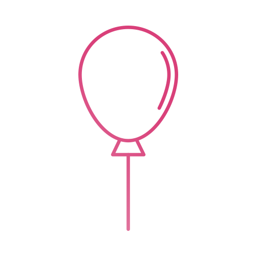

<h1 align="center">
   
</h1>

<h3 align="center">
  Very small and simple utility to bind Event-listeners to elements
</h3>

<p align="center">
    <a href="https://choosealicense.com/licenses/mit/"></a>
	
	<a href="https://www.npmjs.com/"></a>
	
</p>


### ⭐️ Features
* Small and fast
* No jQuery
* Very Lightweight, **> 1KB** gzipped

### 🗜 Install

Via npm
```
$ npm install @simonwep/event-js --save
```

Include via [jsdelivr.net](https://www.jsdelivr.com/)

```javascript
<script src="https://cdn.jsdelivr.net/npm/@simonwep/event-js@0.0.1/event.min.js"></script>
```

Note: Include it at the very bottom of your page!
## ⚙ Usage
```markdown
<div e-[Event name]="[Function name]" eo-[Option name]="[Option value]"></div>
```

Example:
```markdown
<div e-click="doSomething"></div>
```

```javascript
function doSomething() {
    console.log('Hello World!')
}
```

## 📜 Methods
* EventJS.rebind() _- Reloads Eventjs and rebind the events._
* EventJS.destroy() _- Destroys EventJS, removes all event-listeners._
* EventJS.setPrefix(prefix`:String`) _- Set another prefix (instead of `e-`)._
* EventJS.setOptionsPrefix(prefix`:String`) _- Set another option prefix (instead of `e-`)._

## 🔥 Event-name and options

#### Event name `e-`
Everything that you can pass to `.addEventListener`. _(`e-click="..."` `e-mousedown="..."` `e-mousemove="..."` and so on...)_

#### Event options `eo-`
 * `eo-parent` _- The path to the object. Example: `myobject.mylistener`. (the first object must be a children from window)_

## 🛠 Contributing
You have an idea for an option or a feature? [Create an issue!](https://github.com/Simonwep/event/issues)